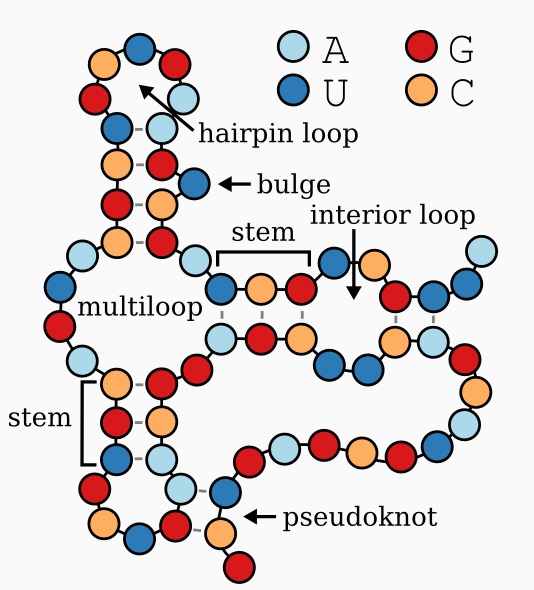

# Paquete rna_structure
```
rna_structure/
├── __init__.py
├── io.py
├── segments.py
├── graph.py
├── structure.py
└── main.py
```


# Ejemplo dot-bracket: example.dbn
>miRNA
GCAUGC
(((..)))
```
python -m rna_structure.main ruta/al/archivo.bpseq
python -m rna_structure.main ruta/al/archivo.dbn
```
## Qué hace el programa?

- Lee tu archivo y construye el mapa de pares de bases.

- Extrae los “stems” (hebras emparejadas) y detecta pseudonudos.

- Filtra los pares dentro de pseudonudos para reconstruir solo la estructura canónica.

- Genera la notación dot-bracket extendida (incluyendo símbolos para pseudonudos).

- Clasifica cada nucleótido en tipos:    
```
Clasifica cada posición en:
      - S: stem
      - M: multiloop
      - I: internal loop
      - B: bulge
      - H: hairpin loop
      - X: external loop
      - E: dangling end
Marca pseudonudos en k_list.
```

Escribe un archivo <basename>.st con toda la información:
```
#Name: example
#Length: 6
#PageNumber: 1
GCAUGC
(((..)))
SSEEMM
NNNNNN
S1 1-4
H1 5-6 "GC"
PK1 2-3
…
```
En <archivo>.st encontrarás:
```
Metadatos (#Name, #Length, #PageNumber).

Secuencia, dot-bracket y las etiquetas lineales (S/M/B/H/I/X/E/K).
```
Listados detallados de cada “stem”, bucle o pseudonudo con sus posiciones y secuencia.

Así, con un único comando tienes desde la lectura de tu archivo de RNA hasta un informe completo de su estructura secundaria.